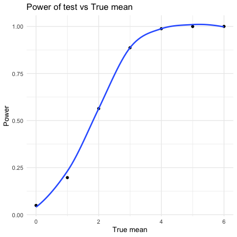
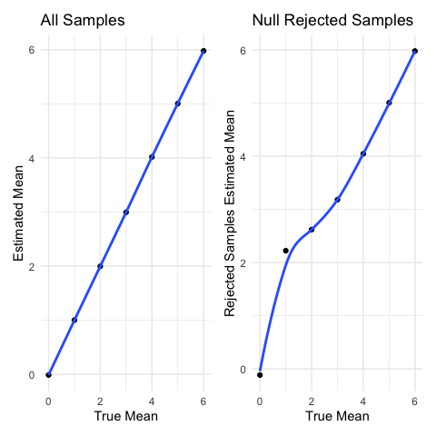

p8105_hw5_hs3393
================
Haochen Sun
2022-11-03

``` r
library(tidyverse)
library(ggplot2)
library(patchwork)

knitr::opts_chunk$set(
  fig.width = 6,
  out.width = "80%"
)

theme_set(theme_minimal() + theme(legend.position = "bottom"))

options(
  ggplot2.continuous.colour = "viridis",
  ggplot2.continuous.fill = "viridis"
)

scale_colour_discrete = scale_colour_viridis_d
scale_fill_discrete = scale_fill_viridis_d
```

## Problem 1

The code chunk below imports the data in individual spreadsheets
contained in `./data/data_prob1/`. To do this, I create a dataframe that
includes the list of all files in that directory and the complete path
to each file. As a next step, I `map` over paths and import data using
the `read_csv` function. (Note: this step is so useful in reading
multiple files) Finally, I `unnest` the result of `map`.

``` r
full_df = 
  tibble(
    files = list.files("data/data-prob1/"),
    path = str_c("data/data-prob1/", files)
  ) %>% 
  mutate(data = map(path, read_csv)) %>% 
  unnest()
```

    ## Warning: `cols` is now required when using unnest().
    ## Please use `cols = c(data)`

The result of the previous code chunk isn’t tidy – data are wide rather
than long, and some important variables are included as parts of others.
The code chunk below tides the data using string manipulations on the
file, converting from wide to long, and selecting relevant variables.

``` r
tidy_df = 
  full_df %>% 
  mutate(
    files = str_replace(files, ".csv", ""),
    group = str_sub(files, 1, 3)) %>% 
  pivot_longer(
    week_1:week_8,
    names_to = "week",
    values_to = "outcome",
    names_prefix = "week_") %>% 
  mutate(week = as.numeric(week)) %>% 
  select(group, subj = files, week, outcome)
```

Finally, the code chunk below creates a plot showing individual data,
faceted by group.

``` r
tidy_df %>% 
  ggplot(aes(x = week, y = outcome, group = subj, color = group)) + 
  geom_point() + 
  geom_path() + 
  facet_grid(~group)
```


This plot suggests high within-subject correlation – subjects who start
above average end up above average, and those that start below average
end up below average. Subjects in the control group generally don’t
change over time, but those in the experiment group increase their
outcome in a roughly linear way.

## Problem 2

``` r
data <- read_csv("data/homicide-data.csv")
```

    ## Rows: 52179 Columns: 12
    ## ── Column specification ────────────────────────────────────────────────────────
    ## Delimiter: ","
    ## chr (9): uid, victim_last, victim_first, victim_race, victim_age, victim_sex...
    ## dbl (3): reported_date, lat, lon
    ## 
    ## ℹ Use `spec()` to retrieve the full column specification for this data.
    ## ℹ Specify the column types or set `show_col_types = FALSE` to quiet this message.

``` r
head(data)
```

    ## # A tibble: 6 × 12
    ##   uid    repor…¹ victi…² victi…³ victi…⁴ victi…⁵ victi…⁶ city  state   lat   lon
    ##   <chr>    <dbl> <chr>   <chr>   <chr>   <chr>   <chr>   <chr> <chr> <dbl> <dbl>
    ## 1 Alb-0…  2.01e7 GARCIA  JUAN    Hispan… 78      Male    Albu… NM     35.1 -107.
    ## 2 Alb-0…  2.01e7 MONTOYA CAMERON Hispan… 17      Male    Albu… NM     35.1 -107.
    ## 3 Alb-0…  2.01e7 SATTER… VIVIANA White   15      Female  Albu… NM     35.1 -107.
    ## 4 Alb-0…  2.01e7 MENDIO… CARLOS  Hispan… 32      Male    Albu… NM     35.1 -107.
    ## 5 Alb-0…  2.01e7 MULA    VIVIAN  White   72      Female  Albu… NM     35.1 -107.
    ## 6 Alb-0…  2.01e7 BOOK    GERALD… White   91      Female  Albu… NM     35.2 -107.
    ## # … with 1 more variable: disposition <chr>, and abbreviated variable names
    ## #   ¹​reported_date, ²​victim_last, ³​victim_first, ⁴​victim_race, ⁵​victim_age,
    ## #   ⁶​victim_sex

The data describes 52179 criminal homicides. The dataset includes the
id, report date of homicides, the victims’ race, name, gender, age, as
well as the place where the homicide happened, specified to city, state,
longtitude and latitude. Also, the data despcribes the result of the
homicide (whether it is closed and someone is arrested).

``` r
casenum <- data %>% 
  janitor::clean_names() %>% 
  unite("city_state", c(city, state), sep = ", ", remove = F) %>%
  mutate(solve = if_else(
    disposition != "Closed by arrest",
    true = "unsolved", false = "solved"
  )) %>% 
  group_by(city_state, solve) %>% 
  summarise(case = n()) %>% 
  pivot_wider(names_from = solve, values_from = case) %>% 
  mutate(total = solved + unsolved)
```

    ## `summarise()` has grouped output by 'city_state'. You can override using the
    ## `.groups` argument.

``` r
Baltimore <- filter(casenum, city_state == "Baltimore, MD")

Baltimore_result <- prop.test(Baltimore[["unsolved"]], Baltimore[["total"]]) %>% 
  broom::tidy() %>% 
  select(estimate, conf.low, conf.high)
```

For Baltimore,MD, the estimated proportion of unsolved homicides will be
0.6456, the confidence interval will be (0.6276,0.6632).

``` r
casenum %>% 
  filter(city_state != "Tulsa, AL") %>% 
  # This is because Tulsa, AL only have 1 sample! Not enough for a proportion test, so just leave it out
  
  mutate(
    prop_test = map2(.x = unsolved, .y = total, ~prop.test(x = .x, n = .y))
    ) %>% 
  mutate(
    prop_test = map(prop_test, broom::tidy)
  ) %>% 
  unnest(prop_test) %>% 
  select(city_state:estimate, conf.low, conf.high) %>%
  ungroup() %>% 
  mutate(city_state = fct_reorder(city_state, estimate)) %>% 
  ggplot(aes(x = city_state, y = estimate)) +
  geom_point(size = 1) + 
  geom_errorbar(aes(ymin = conf.low, ymax = conf.high), width = 1) +
  coord_flip() +
  labs(y = "Estimate proportion", x = "City", title = "Estimated proportion of unsolved homicides in each city")
```


## Problem 3

``` r
sim_df = 
  expand_grid(
    id = 1:5000,
    mean = 0:6
  ) %>% 
  mutate(
  sets = map(.x = mean, ~rnorm(n = 30, mean = .x, sd = 5 ))
    ) %>% 
  mutate(t_result = map(sets, t.test)) %>% 
  mutate(t_result = map(t_result,  broom::tidy)) %>%
  unnest(t_result) %>% 
  select(id, mean, estimate, p.value)

sim_df %>% 
  mutate(decision = if_else(p.value < 0.05, true = "reject", false = "fail_to_rej")) %>%
  filter(decision == "reject") %>% 
  group_by(mean) %>% 
  summarise(power = n()/5000) %>% 
  ggplot(aes(x = mean, y = power)) + 
  geom_point() + 
  geom_smooth(method = "loess", se = F) +
  labs(x = "True mean", y = "Power", title = "Power of test vs True mean")
```

    ## `geom_smooth()` using formula 'y ~ x'



As the true value of $\mu$ increases, the power of test also increases.

``` r
plot1 <- sim_df %>% 
  mutate(decision = if_else(p.value < 0.05, true = "reject", false = "fail_to_rej")) %>% 
  group_by(mean) %>% 
  summarise(average = mean(estimate)) %>% 
  ggplot(aes(x = mean, y = average)) +
  geom_point() +
  geom_smooth(method = "loess", se = F) + 
  labs(x = "True Mean", y = "Estimated Mean",
       title = "All Samples")
  


  
plot2 <- sim_df %>% 
  mutate(decision = if_else(p.value < 0.05, true = "reject", false = "fail_to_rej")) %>% 
  filter(decision == "reject") %>% 
  group_by(mean) %>% 
  summarise(
    count = n(),
    rej_average = mean(estimate)) %>% 
  ggplot(aes(x = mean, y = rej_average)) +
  geom_point() +
  geom_smooth(method = "loess", se = F) +
  labs(x = "True Mean", y = "Rejected Samples Estimated Mean",
       title = "Null Rejected Samples")

plot1 + plot2
```

    ## `geom_smooth()` using formula 'y ~ x'
    ## `geom_smooth()` using formula 'y ~ x'



The average of $\hat{\mu}$ in samples for which the null was rejected is
not approximately equal to the true $\mu$ when the true $\mu$ is close
to the $\mu$ in the null hypothesis. But when the true $\mu$ is not
close to the $\mu$ in the null hypothesis, they will be approximately
equal.

That is because under this circumstance, the sample distribution have
much overlap with the distribution of null hypothesis. Therefore, those
samples close to the mean in $H_0$ will not be rejected. Then the
distribution of samples for which null was rejected will not be
symmetric to the true mean, there will be more samples on the side that
are far away from the mean in $H_0$. For example, the mean of the
samples for which null was rejected, whose real mean is 1, will be
larger than 1. 0 is an exception even though 0 is exactly the same as
the mean in $H_0$, because the rejected samples will be those that
further away from 0, but these samples contains positive and negative
ones and are approximately symmetric to zero, therefore the mean of
these samples will be close to 0 (the true mean).

When the true mean is far from the mean in null hypothesis, nearly all
samples will reject $H_0$ so the mean of samples for which the null was
rejected will approximately equal to the true value of $\mu$. (In this
problem, for example, when true mean is equal to 0).
